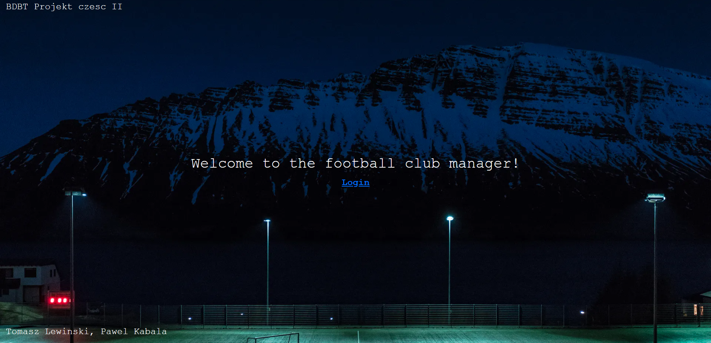
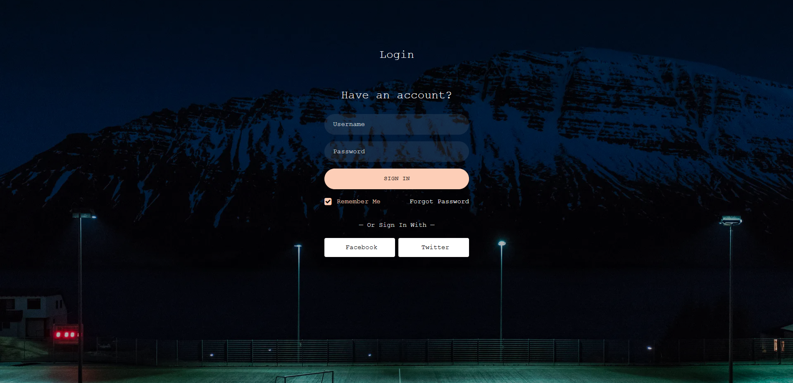
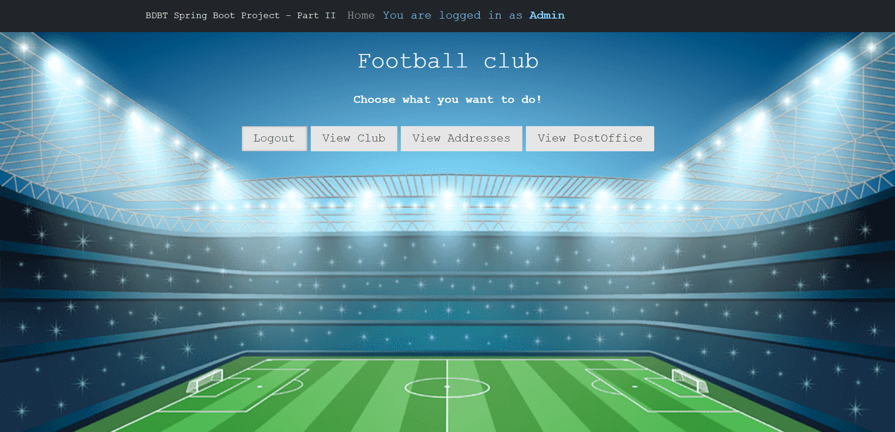
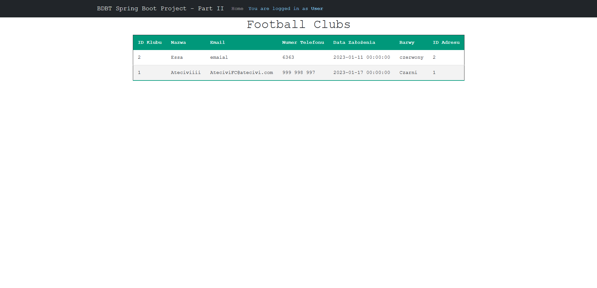
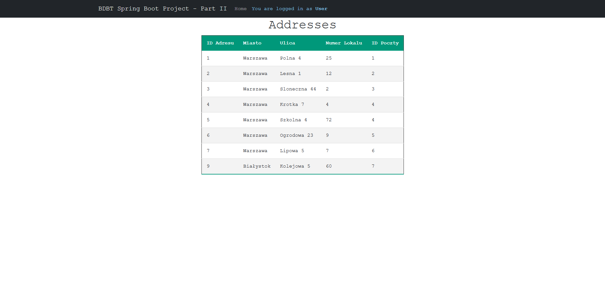
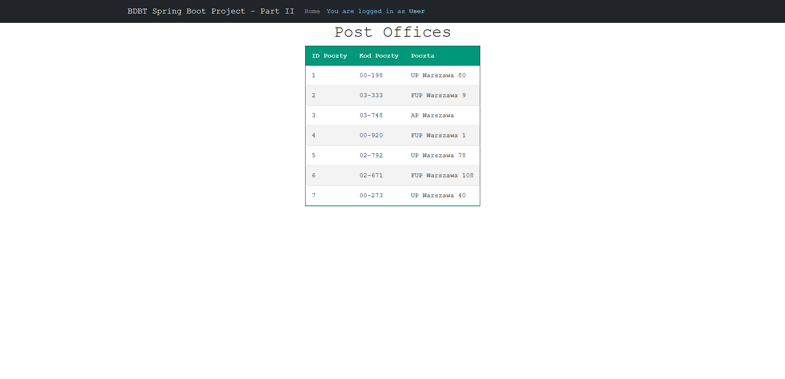
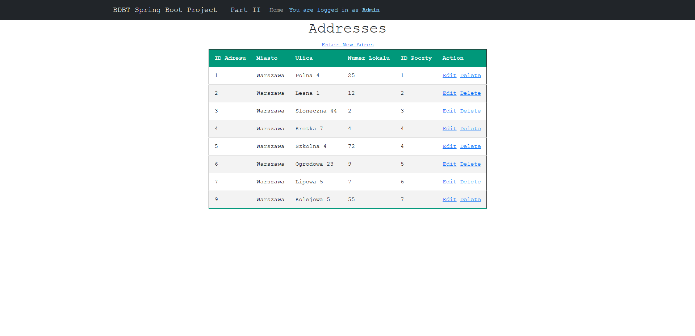

# Table of Contents

- [Football Club Manager Spring Application](#football-club-manager-spring-application)
  * [Overview](#overview)
  * [Technologies](#technologies)
  * [Project Description](#project-description)
  * [Login Screen](#login-screen)
  * [Homepage](#homepage)
    + [Functionality for the Narrow Perspective](#functionality-for-the-narrow-perspective)
    + [Functionality of the Wide Perspective](#functionality-of-the-wide-perspective)
  * [Project Summary](#project-summary)

# Football Club Manager Spring Application

## Overview
This project aimed to create an application utilizing a previously established database. It represents the second part of a larger project that was completed by myself. However, my role did not extensively involve designing the database. My focus was primarily on leveraging the existing database to build and develop the application, showcasing my ability to work with pre-defined structures and integrate them into a functional software solution.

## Technologies
Developed with:
  * Java, JavaScript, HTML, CSS, SCSS
  * Spring Framework, Maven, Tomcat Server
  * IntelliJ IDEA Ultimate Edition, GitHub

## Project Description
This project for school helped me learn how to use Spring Boot and combine front-end and back-end technologies. I worked on making an application that connects to a database. Using tools like Maven and Tomcat Server made the work easier. This project was a simple but real example of how to build an app by bringing different parts of programming together.

## Login Screen

The button named "Forgot Password" will redirect the user back to the home page. The "Facebook" and "Twitter" buttons do not lead to any page and serve only an aesthetic function in our application. However, these buttons could be easily modified if there was a need to add new functionalities in the future.

## Homepage

It's worth noting that the user and admin perspectives do not differ except for the information in the top right corner, indicating the role you're currently in. This is because there was no need for these two perspectives to be different on the home page.

### Functionality for the narrow perspective
In the "USER" permissions, the access was granted to entities such as FOOTBALL CLUBS, ADDRESSES, and EMAILS.

### Functionality of the wide perspective
The "ADMIN" type user has permissions to add, edit, and delete entries in all entities. They can do this without any restrictions, unlike the "USER" type, who only has viewing access to the entity's content. We have also implemented security measures within the application that prevent any user other than "ADMIN" from accessing the page that allows for editing entities by entering the specific address in the browser.
 
For example below is the view of the ADRESSES entitie seen from the admin perspective

## Project Summary
The entire application works seamlessly and fulfills its purpose. Of course, there are many functionalities that could be implemented given more time. Currently, the site has a very simple and intuitive form, with a straightforward interface for adding and editing entries. In the future, the way additions and edits are made could be modified, for example, by adding an interactive team color picker instead of manual entry, the ability to change the site's theme to dark mode, and similar enhancements. However, at this moment, I have created an application that possesses all the essential functionalities.

